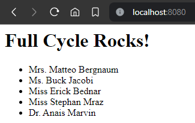

# 🐋 Docker: Desafio nginx com Node.JS | Full Cycle
Repositório do desafio "nginx com Node.JS" do curso Full Cycle

## 📄 Instruções
Ao acessar o nginx, a aplicação Node.JS receberá uma chamada, que por sua vez irá registrar um nome
na tabela **people** do banco de dados MySQL.

O retorno da aplicação Node.JS para o nginx deve ser:

> \<h1>Full Cycle Rocks!!\</h1>
>
> \- Lista de nomes cadastrados no banco de dados

A porta **8080** deverá ser utilizada para acessar o nginx.

## 🛠 Execução
Execute o comando abaixo.

```bash
docker-compose up -d
```

## 🖼️ Evidências



## 🔗 Links
- [Aplicação](http://localhost:8080/)